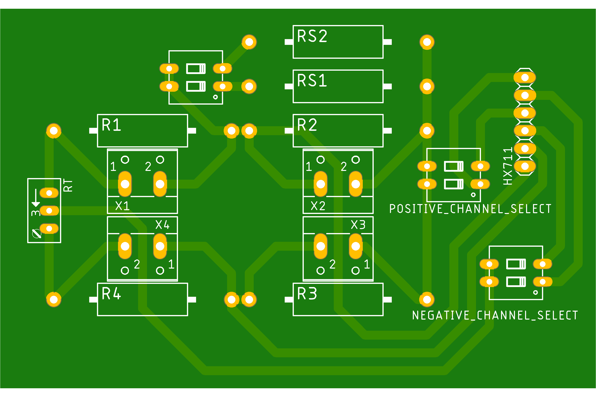

<!-- PROJECT SHIELDS -->
<!--
*** I'm using markdown "reference style" links for readability.
*** Reference links are enclosed in brackets [ ] instead of parentheses ( ).
*** See the bottom of this document for the declaration of the reference variables
*** for contributors-url, forks-url, etc. This is an optional, concise syntax you may use.
*** https://www.markdownguide.org/basic-syntax/#reference-style-links
-->
<!-- 
[![Contributors][contributors-shield]][contributors-url]
[![Forks][forks-shield]][forks-url]
[![Stargazers][stars-shield]][stars-url]
[![Issues][issues-shield]][issues-url]
[![MIT License][license-shield]][license-url]
[![LinkedIn][linkedin-shield]][linkedin-url]
-->

<!-- PROJECT LOGO 
 

  

  <h3 align="center">Best-README-Template</h3>

  

    An awesome README template to jumpstart your projects!
     
    <a href="https://github.com/othneildrew/Best-README-Template"><strong>Explore the docs »</strong></a>
     
     
    <a href="https://github.com/othneildrew/Best-README-Template">View Demo</a>
    ·
    <a href="https://github.com/othneildrew/Best-README-Template/issues">Report Bug</a>
    ·
    <a href="https://github.com/othneildrew/Best-README-Template/issues">Request Feature</a>
  

-->

<!-- TABLE OF CONTENTS 

  
Table of Contents

  <ol>
    <li>
      <a href="#about-the-project">About The Project</a>
      <ul>
        <li><a href="#built-with">Built With</a></li>
      </ul>
    </li>
    <li>
      <a href="#getting-started">Getting Started</a>
      <ul>
        <li><a href="#prerequisites">Prerequisites</a></li>
        <li><a href="#installation">Installation</a></li>
      </ul>
    </li>
    <li><a href="#usage">Usage</a></li>
    <li><a href="#roadmap">Roadmap</a></li>
    <li><a href="#contributing">Contributing</a></li>
    <li><a href="#license">License</a></li>
    <li><a href="#contact">Contact</a></li>
    <li><a href="#acknowledgments">Acknowledgments</a></li>
  </ol>

-->

<!-- ABOUT THE PROJECT -->
## About The Project

<!-- [![Product Name Screen Shot][product-screenshot]](https://example.com) -->

This is a simple PCB that is designed to work with commonly found HX711 Arduino module. So, this is an extension to the original HX711 module shown below.

This is still under work. Design is finished. However, I am still writing the manual. As you can see, even for first grade electronical engineering students, there is actually nothing hard or important about this repo, since this is a simple wheatstone bridge for HX711 module. However, while I work in my university, several students from computer sciences and engineering departments required a simple wheatstone bridge for strain gauge applications. This was a design for a really primative strain reader. It will not be useful in data acquisition applications, but it will help you learn if you are a new starter to strain gauge applications. It will, also, give you a great trick to easily calibrate your system or readings. A calibration that does not only calibrates the IC, but calibrates the whole system.

<b>Why do you need a PCB when you can do new-starter-things on breadboard?</b>

Since wheatstone bridges are really sensitive, it is imposible to acquire data on breadboards. If you like to see why, build a wheatstone bridge on breadboard with any 24bit ADC and softly blow on the breadboard. The readings will go crazy. Also, any use of standard breadboard jumpers will have the same efect. This SIMPLE one sided PCB is to minimize such enviromental effect. 

<b>BE CAREFUL!</b>
 
This PCB is designed to work with HW-27 Arduino module. However, it will work for the modules that has the same "J1" (see picture below) pin configuration.

(<a href="#top">back to top</a>)

### Built With

The design and shematics are made in Eagle. I aim to add universal data packages as well. However, if you would like to change the dimensions, packages, or anything else, Eagle is a free software right now.

* [Eagle](https://www.autodesk.com/products/eagle/free-download)

(<a href="#top">back to top</a>)

<!-- GETTING STARTED -->
## Getting Started

There are several ways to use the PCB. It mainly depends on your budget and requried output quality. NO DOT FORGET that, HX711 is not an IC that a medium or advanced strain reader can be designed from. With that in mind, if you want to use the bridge, you can simply produce it however you want, but do not spend too much money on this. 

If you are going to use HX711 with load cells, this is not for you. This repo is basically for an adapter to use strain gauges with HX711. A simple extension.

If you are going to use strain gauges and would like to read the ADC data with HX711, please do continue.

After this point, every value, name or component will be reffered to the following image, if otherwise not stated. Take the image as refference. 

### Prerequisites

First of all, you need to know basics of wheatstone bridge, and calculations. If you dont know where to start, HBM provides a good start-up knowledge [here](https://www.hbm.com/en/7163/wheatstone-bridge-circuit/). If you already have another source, you can use that as well, but be careful of resistor names, exitation points and reading points. They will vary.

You are requried to know how ADC output works.
### Choosing the Strain Gauge

In here, if you already have a strain gague, use that. However, if you do not have any strain gauges, there are 3 ohm values: 120, 350, 1000 ohms. Choose as you like, but remember you will need to buy resistors according to those values. So becareful if you will be able to supply resistors.
Quality of the strain gauges is totally up to your bugdet. If this is your first time, buy the cheap ones. However, be careful to get EXACT gauge factor. Without exact factor, you can not convert ADC readings to meaningful strain values. This value is not SAME all over a single product from a single factory. High end suppliers measure and give exact strain gauge factor for every batch of gauges.

You will require following resistors for following strain gauge resistance values. 

Assuming quarter-bridge configuration with trimpot as zero-balancer;

| Strain Gauge  | Required Resistors | Required TrimPots|
| ------------- | ------------- | ------------- |
| Ohm  | NumberofResistorsxOhm | NumberofTrimpotsxOhm |
| 350 Ω  | 3x330   | 1x50 |

Okay, I am gonna take a lot of heat from that table. Because most of the resistor values are not avaliable. I know that. This is IDEALLY. I will talk about the implementation as well.

Secondly, how we calculate the resistor values is this. Assume R2 to be your strain gauge, so 120 Ω, 350 Ω or 1000 Ω. For the PCB above, <b>(R4+RT/2)/(R1+RT/2)</b> should be equal to <b>R2/R3</b>. You can decide your resistor values like this, or you can use my implementation, which will be based on 350 Ω stain gauges and most common resistor values. BE CAREFUL your choose of resistors will effect the output. So you may need to do more calculations.

So if we chose 350 Ω strain gauge, and 330 Ω commonly found resistors for R1, R3 and R4, as a trimpot 50 Ω for RT, and set the trimpot to divide resistance 36 Ω to 14 Ω (which 36 Ω should be added serially to R1) system ALMOST balances. So balance equation becames;
| Left Side  | Right Side |
| ------------- | ------------- |
| 1.063953488  | 1.060606061  |

Remaining unbalance can be corrected with trimpot easily.

<b> As a final important note, DO NOT USE your strain gauges without properly gluing it to a proper reading surface. Strain gauges consists of a thin backing layer, which will not stand usage on their on. Find a piece of metal, plastic or anything, apply the strain gauge with a proper and strong adhesive, use strain gauge terminal to increase the cable dimension, and make sure your cables are not going to rip off. It is really easy to damage the cables of strain gauge.
</b>

### Choosing Bridge Structure
In here, the first thing you need to know is if you are going to need a manual way to zero balance the bridge. This depends on several things like resistor tolerances, ADC gain (PGA) and required reading range. Simply, if you are using high gain with high tolerances, your zero reading may be off scale already. In that case, your system will not work at all.

So, if you are using %5 tolerance resistors with the implementation given in the <b>Choosing the Strain Gauge</b> topic, due to resistor tolerances, there can be up to 0.25 V initial imbalance. However, at the largest reading range, (5 V exitation, 32 gain) HX711 will read voltages between +0.078125 V and -0.078125 V. As you can see, the resistor tolerances will shift your output to out of range. This is why a trimpot is used in the system to zero-balance the bridge.

The only case you can implement the given bridge without trimpot is if you have 0.1% tolerance resistors which are quite expensive. It would not be logical to dump so much money into a system of this quality. So, if you do not know better, use trimpot to zero balance the system, so you can use cheap solutions. Also, in this tolerance calculation, resistance of PCB pathways are neglected. If you include pathway resistances, tolerances and PCB quality becames much thighter, meaning even more expensive.

So, if you use 

330 Ω resistors for R1, R3 and R4,

350 Ω strain gauge for R2,

and 50 Ω trimpot for RT

you will make the bridge work. However, this implementation will make things a bit harder later on, in calibration, but it will be nothing that a little math cannot solve.

### Choosing Shunt Calibration Resistors
Shunt calibration resistors are used to apply a virtual strain to the system. Since the applied values of resistors are known and output can be obtained, system can be calibrated. [There](http://www.vishaypg.com/docs/11064/tn514.pdf) is an excellent guide on how to use and calculate shunt calibration. In this implementation, I am going to use 2 resistors, since we have much higher tolerances and not so sensetive bridge. Choosing the resistor values depends on your reading range. It is better to apply higher strains, which means lower resistor values on shunt calibration. However, it cannot exceed the reading range of the ADC. So ideally, if you apply 10 kΩ parallel resistor to system (as RS1 or RS2) you will cause 0.043005 V shift in ADC reading. Since 32 gain measures voltages between +0.078125 V and -0.078125 V, this will work. However, 128 gain and 64 gain will have a reading range of ±0.01953125 V and ±0.0390625 V, respectively. 10 kΩ shunt calibration resistors will not work for 128 and 64 gain, since it will shift the value out of range. 

<b> If you do not know which gain you are going to use, 50 kΩ and 100 kΩ shunt calibration resistors will work fine.</b>

(<a href="#top">back to top</a>)

### List of Components
To use my implementation with 350 Ω strain gauges, you will need;

- 3 x 330 Ω resistor (prefer metal film, or as low tolerance as can be)
- 1 x 50 Ω trimpot (prefer as much turn as possible. Usualy I use 20 turn)
- 1 x 2 pin connector (to your preference)
- 3 x DIP Switch
- 1 x 50 kΩ resistor for RS1
- 1 x 100 kΩ resistor for RS2

(<a href="#top">back to top</a>)

### Preliminary Measurements
This step is the most important step. To have a proper measurement, you have to know your resistor values. You can use a simple multimeter, or anything more advanced. My procedure is as follows;
1. Measure R1, R3, R4 and RT, and SAVE them somewhere you will not missplace.
2. (optional) If you want more precision, you can measure the PCB pathway resistances and add them to proper resistor values. 
3. ONLY solder the RS1, RS2 and DIP switch that connects shunt calibration resistors to the main bridge. 
4. Measure the resistor values at the ends of RS2 (be careful R2 is not soldered yet.) in 3 possible states and SAVE them somewhere you will not missplace. 3 possible states are;
    - switch1 (RS1) on, switch2 (RS2) off
    - switch1 (RS1) off, switch2 (RS2) on
    - switch1 (RS1) on, switch2 (RS2) on
5. You can now solder the remaining parts.

(<a href="#top">back to top</a>)

### Soldering

It is assumed that the PCB is one sided and components are on the other face of the copper layer. However, since all the components are passive, you can switch sides, except HX711 pins.

BE CAREFUL to follow soldering order given in <b>Preliminary Measurements</b> to obtain best results.

There are 2 elements to every component at a wheatstone bridge, a resistor and a connector. Connector is to add strain gauge to system, and resistors are static componenets. So, if you are going to use quarter-bridge, DO NOT solder X1, X3 and X4 connectors, but solder R1, R3 and R4 resistors. To add the strain gauge, DO NOT solder R2 resistor, but solder X2 connector. For other bridge implemetations, logic is same. So, you eighter use a connector or a resistor.

## Calibration

If you are going to calibrate the system with any other method, or if you do not require a calibration, you may skip this step. But if you need calibration, we will conduct a Ax+B calibration.

To do so, it is required to know shunt calibration resistor values, bridge resistor values and virtual strain that is applied by shunt calibration resistors. Assuming R1, R3 and R4 to be static, 

Epsilon_s = -R_G/(F_G*(R_G+R_S))

where;

Epsilon_s   : Strain on the strain gauge (m/m)
R_G         : Strain gauge resistance value (Ω)
R_C         : Shunt calibration resistor value (Ω)
F_G         : Strain gauge factor (must be given by supplier)

By conducting the calculation for every state of RS1 and RS2 switch, you will have 3 strain values and 3 outputs from the ADC. You do not have to but you can also add your zero reading (not perfectly zero) to this data set, which makes 4 strain values and 4 ADC outputs (given as Parameters in <b>Usage</b>). Only remaining thing is to linearly convert ADC values to match strain values. 
1. First thing I suggest you to do is a chech of system. To do that, take your readings (4 strain, 4 ADC output) and calculate linear regression error. As an alternative, you can use Microsoft Excel (or any other related software) draw the diagram of data as scatter graph, then make Excel to calculate equation and R^2 value. If your R^2 value is realy close to 1, you have a good working system.
2. By appling the calculations above, you should have 4 strain values (Epsilon_s).
3. Take the values from ADC output that are designated as <b>Parameter: ADCout0, ADCout1, ADCout2, ADCout3 </b>
4. Make a table.

| Strain values | ADC Outputs |
| ------------- | ------------- |
| Epsilon_s=0 | ADCout0 |
| Epsilon_s RS1 | ADCout1 |
| Epsilon_s RS2 | ADCout2 |
| Epsilon_s Rs1 and RS2 | ADCout3 |

5. Calculate the number that you need to multiply and add with ADCout to match with epsilon values.

For example,
| Strain values | ADC Outputs | ADCout x A + B | Calibrated Output |
| ------------- | ------------- | ------------- | ------------- |
| 0 | 1000 |  1000 x -0.00001 + 0.01 | 0 |
| -0.01 | 2000 | 2000 x -0.00001 + 0.01 | -0.01 |
| -0.02 | 3000 | 3000 x -0.00001 + 0.01 | -0.02 |
| -0.03 | 4000 | 4000 x -0.00001 + 0.01 | -0.03 |

<b> Readings in this method are always gives results in compressive strain.</b>

## Usage
First of all, you need to select a channel, POSITIVE_CHANNEL_SELECT and NEGATIVE_CHANNEL_SELECT switches are made for that. I added this switches and I have not tested it. It is simply to direct signal to channels. This may not be necessery. If you are sure you do not need that, you can short the connections. However, if you are going to use;

If you are going to use channel A, 
- set POSITIVE_CHANNEL_SELECT, 1st to off and 2nd to on
- set NEGATIVE_CHANNEL_SELECT, 1st to off and 2nd to on

If you are going to use channel B, 
- set POSITIVE_CHANNEL_SELECT, 1st to on and 2nd to off
- set NEGATIVE_CHANNEL_SELECT, 1st to on and 2nd to off

Make sure switch of RS1 and RS2 are open (is not connected to system) (off).

Then power-up the system and take ADC readings. Turn the trimpot RT untill you get a zero or near zero reading. Take a several second stable reading, take the average and save. <b>Parameter: ADCout0</b>

<b>IMPORTANT NOTE: DO NOT use any code that has in-code zero function (tare). Make sure that you are seeing the direct output of the ADC</b>

After you have your zero level; 
- Close switch that is connected to RS1, take a several second stable reading, take the average and save. <b>Parameter: ADCout1</b>
- Close switch that is connected to RS2, take a several second stable reading, take the average and save. <b>Parameter: ADCout2</b>
- Close switchs that is connected to RS1 and RS2, take a several second stable reading, take the average and save. <b>Parameter: ADCout3</b>
- 
<b> While calibrating, DO NOT change the strain of the material your strain gauge is placed. Make sure there are no external loads on measured part.</b>
<b> While closing and opening switches, please wait for system to converge.</b>

After this step, open the switches of RS1 and RS2. Now, you are ready to take your strain reading. In this method, you will convert your readings into meaningful strain values after you completed strain readings. However, after calculating necessary calibration values, you can input those values to your code that reads ADC as well. 

(<a href="#top">back to top</a>)

## License

This is not licensed. You can steal it. 

(<a href="#top">back to top</a>)

<!-- CONTACT -->
## Contact

Fahri Emre Özdemir - [@linkedin](https://www.linkedin.com/in/fahriemreozdemir/)

Project Link: [HX711_SimpleBridge](https://github.com/maviterlikli/HX711_SimpleBridge/)

(<a href="#top">back to top</a>)

<!-- MARKDOWN LINKS & IMAGES -->
<!-- https://www.markdownguide.org/basic-syntax/#reference-style-links -->
[contributors-shield]: https://img.shields.io/github/contributors/othneildrew/Best-README-Template.svg?style=for-the-badge
[contributors-url]: https://github.com/maviterlikli/HX711_SimpleBridge/graphs/contributors
[forks-shield]: https://img.shields.io/github/forks/othneildrew/Best-README-Template.svg?style=for-the-badge
[forks-url]: https://github.com/maviterlikli/HX711_SimpleBridge/network/members
[stars-shield]: https://img.shields.io/github/stars/othneildrew/Best-README-Template.svg?style=for-the-badge
[stars-url]: https://github.com/maviterlikli/HX711_SimpleBridge/stargazers
[issues-shield]: https://img.shields.io/github/issues/othneildrew/Best-README-Template.svg?style=for-the-badge
[issues-url]: https://github.com/maviterlikli/HX711_SimpleBridge/issues
[license-shield]: https://img.shields.io/github/license/othneildrew/Best-README-Template.svg?style=for-the-badge
[license-url]: https://github.com/maviterlikli/HX711_SimpleBridge/blob/master/LICENSE.txt
[linkedin-shield]: https://img.shields.io/badge/-LinkedIn-black.svg?style=for-the-badge&logo=linkedin&colorB=555
[linkedin-url]: https://linkedin.com/in/fahriemreozdemir
[product-screenshot]: images/screenshot.png
